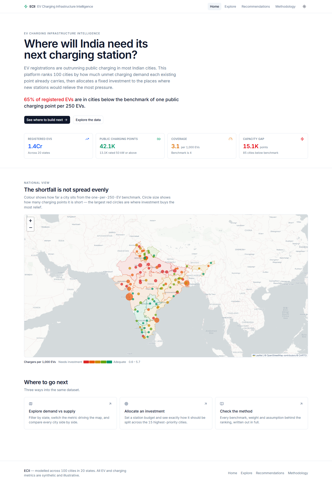
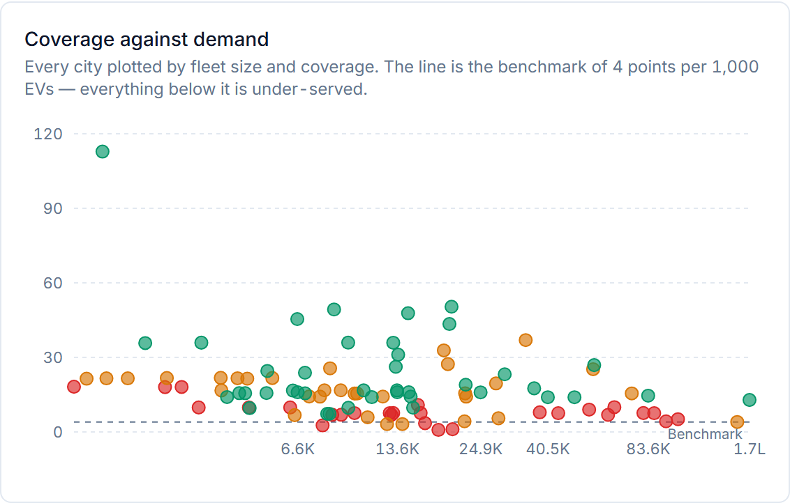
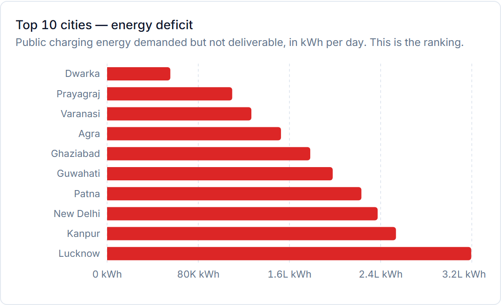
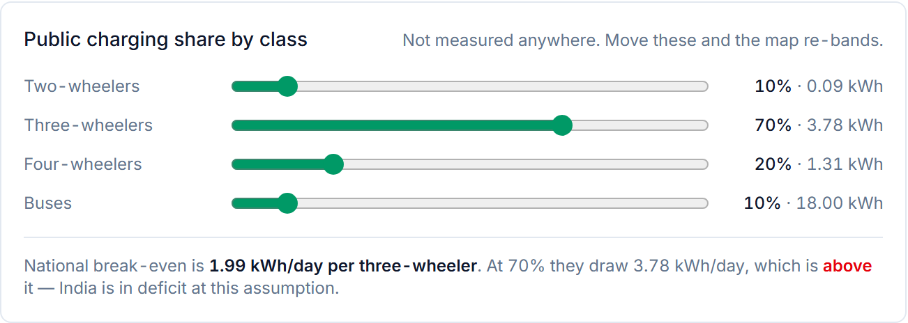
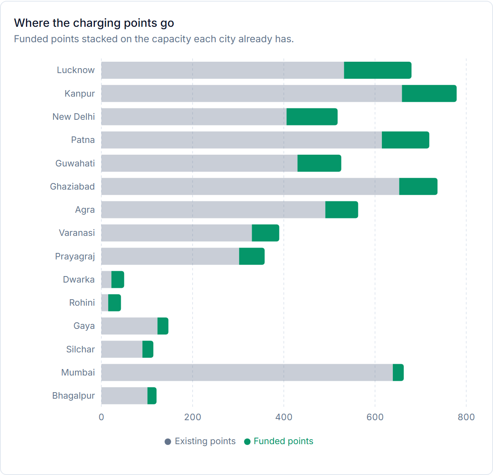
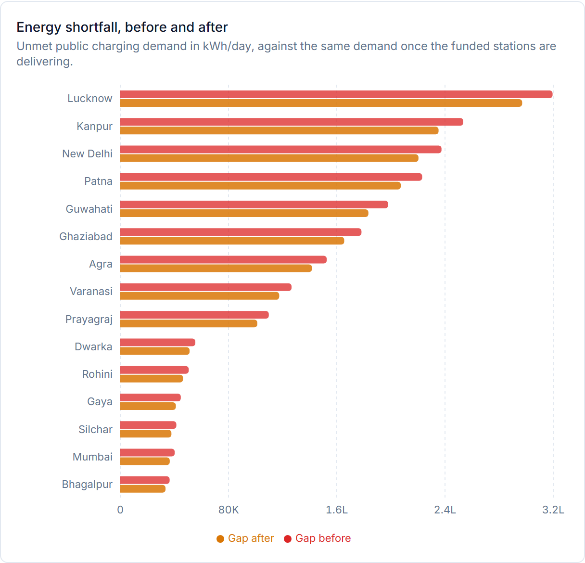

<div align="center">

<h1>⚡ EVIP</h1>

<p><strong>EV Charging Infrastructure Intelligence</strong></p>

<p><em>A geospatial decision-support tool for siting India's next public charging stations —<br>built on published Ministry of Power, Vahan and OpenStreetMap data.</em></p>

<p>
  
  
  
  
  
  
</p>

</div>

---

> **If investment is limited, where should India's next public charging stations be built?**

That is the only question this application exists to answer. It is not a dashboard. It ranks
100 Indian cities by the **public charging energy their fleets demand but cannot get**, then
splits a fixed station budget across the places where new capacity relieves the most unmet
demand.



---

## The finding

Counting chargers per vehicle says India's cities are comfortably supplied. Counting energy
says the opposite, and the two answers are not close.

|                                    | Verdict                                        |
| ---------------------------------- | ---------------------------------------------- |
| **13.6 points per 1,000 EVs** — 3.4× the 1-per-250 benchmark | Surplus  ✅ |
| **1.64 M kWh/day of unmet demand** — demand at 1.71× deliverable supply | Deficit  ❌ |



<sub>All 100 cities, log fleet size against coverage. Almost every city clears the dashed benchmark — yet the red and amber points, coloured by demand-to-supply ratio, are the ones already short on energy. Coverage and adequacy disagree.</sub>

Per-vehicle coverage treats an e-2W and an e-rickshaw as one unit of demand each. India's
fleet is not built that way. A three-wheeler on a commercial duty cycle draws roughly **42×**
the public charging energy of a two-wheeler, so in a fleet that is 42% three-wheelers the
choice of unit does not simplify the answer — it decides it.

| Class          | Share of modelled fleet | Public draw per vehicle | Share of public demand |
| -------------- | ----------------------: | ----------------------: | ---------------------: |
| Two-wheelers   |                   53.6% |          0.09 kWh/day    |                   2.8% |
| Three-wheelers |                   42.3% |          **3.78 kWh/day** |             **92.2%** |
| Four-wheelers  |                    4.0% |          1.31 kWh/day    |                   3.0% |
| Buses          |                    0.2% |         18.00 kWh/day    |                   2.0% |

Three-wheelers are 42% of the vehicles and 92% of the problem. Everything downstream — the
ranking, the map colours, the allocation — is denominated in kWh/day for that reason.

## The model

Four pure functions in [lib/scoring.ts](lib/scoring.ts), no fitted parameters, no fabricated
operational fields:

```
demand_kwh_day  = Σ over classes ( fleet × km_per_day × kWh_per_km × public_share )
supply_kwh_day  = total_kw × 24 h × 0.20          ← capacity utilisation
deficit_kwh_day = demand_kwh_day − supply_kwh_day ← positive means unmet demand
priority_score  = max(0, deficit_kwh_day)         ← the ranking, in kWh/day
```

Priority **is** the unmet energy. There are no queue, density or population multipliers: those
existed to correct a base with no physical meaning, and a daily energy shortfall needs no
correction — it already scales with fleet size and already reflects how badly served a city is.
Cities in surplus score 0 rather than negative; spare capacity is no claim on the next station,
not an anti-claim.

Growth never touches the score. It lives only in the ten-year projection, where a negative rate
(Uttarakhand registered fewer EVs in 2023 than 2022) cannot invert the ranking.

**Severity** is a fixed ratio of demand to deliverable supply, not a percentile — 1.0 is
break-even, 2.0 is demand at double capacity. Fixed cut points mean the sliders move cities
between bands, and that movement is the point of the interface.

| Band                          | Cities at default assumptions |
| ----------------------------- | ----------------------------: |
| 🔴 Demand over 2× supply      |                            27 |
| 🟠 Demand exceeds supply      |                            32 |
| 🟢 Supply covers demand       |                            41 |



<sub>The ranking the model produces. Uttar Pradesh takes four of the top ten — a large three-wheeler fleet against thin installed capacity, which per-vehicle coverage alone would not have surfaced.</sub>

Every threshold, rate, cap and bound lives in [lib/constants.ts](lib/constants.ts). Nothing
else hard-codes a number.

## Where the data comes from

Five published sources, fetched at build time. Nothing is invented, and nothing is copied by
hand.

| Source                          | Publisher              | Supplies                                    | Rows |
| ------------------------------- | ---------------------- | ------------------------------------------- | ---: |
| EV charging stations installed  | Ministry of Power      | Every supply figure — 25,852 stations        |   37 |
| Total registered EVs by state   | Vahan (MoRTH)          | Demand level — 36.4 lakh EV stock            |   36 |
| EVs registered by year, 2020–23 | Vahan (MoRTH)          | Year-on-year growth, computed 2022→2023      |   34 |
| EVs registered by vehicle class | Vahan (MoRTH)          | The 2W / 3W / 4W / bus split                 |   35 |
| Charging stations (Overpass)    | OpenStreetMap          | Points per station, kW rates, urban share    |  657 |

The pipeline is two stages, and the split between them is deliberate:

```
                 network                    no network
  ┌────────────────────────┐   ┌───────────────────────────────────────┐
  │ scripts/fetch-sources  │ → │ scripts/build-cities                  │
  │ data.gov.in + Overpass │   │ data/raw/ → cities.json               │
  │ paginate, retry, cache │   │           → QUALITY.md, sensitivity   │
  └────────────────────────┘   └───────────────────────────────────────┘
        data/raw/*.json              deterministic — no seed, no RNG
```

Stage ① only fetches; stage ② only derives. Delete `data/cities.json`, re-run stage ②, and it
reproduces byte for byte with the network unplugged.

**Absolute levels are real; the shape within a state is modelled.** Published data stops at
state resolution, so a state total is split across its cities by OSM station density where OSM
has coverage and by population where it does not — weight `n/(n+20)`, so a state with 51 mapped
stations leans on OSM and one with 2 leans on population. Every row carries its own provenance:

| Tier         | Meaning                                              | Rows                            |
| ------------ | ---------------------------------------------------- | ------------------------------- |
| `reported`   | Published at this resolution, used unchanged          | —                               |
| `modelled`   | A real state total split across that state's cities   | 95 registrations, 100 supply    |
| `imputed`    | The state total itself was estimated                  | 5 (Telangana, absent from Vahan) |

41 of 100 cities have at least one station actually mapped in OSM.
[data/QUALITY.md](data/QUALITY.md) is generated by the build and carries the full
reconciliation: source vintages, the three Vahan tables that must not be mixed, per-state
station and fleet counts, and every warning raised during the run.

## Does the sign hold?

The national deficit rests on two numbers nobody has measured: the three-wheeler fleet size and
the share of its energy drawn publicly. Demand scales with their **product**, so break-even is a
single threshold — 7,13,292 on these inputs — and bounding one factor while holding the other
fixed proves nothing about the corner where both sit low.

National deficit, million kWh/day. **Positive is deficit.**

| e-3W fleet                     | 20% public | 37% public | 70% public | 90% public |
| ------------------------------ | ---------: | ---------: | ---------: | ---------: |
| 9,19,025 *(Dec-2022 floor)*    |      −2.38 |      −1.68 |      −0.31 |      +0.51 |
| 12,31,706                      |      −2.10 |      −1.16 |      +0.67 |      +1.78 |
| 15,44,387                      |      −1.82 |      −0.64 |      +1.66 |      +3.05 |
| 18,57,068 *(central)*          |      −1.54 |      −0.12 |      **+2.64** |  +4.31 |

The deficit holds across the plausible range. It reverses only if the fleet sat at its measured
December 2022 floor **and** public share were roughly half the assumed value at the same time —
at that floor, break-even share is 0.78, not 0.38. That corner is unlikely but live, and
`npm run check` asserts it stays live rather than quietly closing.

The Explore page exposes the public-share assumption as four live sliders, one per vehicle class.
Everything rescores on every move: the map, the charts, the table and the severity bands.



<sub>The assumption is a control, not a constant. Each slider reports the resulting per-vehicle draw in kWh/day next to the 1.99 kWh/day national break-even, so the reader can see exactly how far the default sits from flipping the sign.</sub>

## Recommendations

Set a budget between 25 and 1,000 stations. Each station is a fixed 4-point site — 2 DC fast at
60 kW and 2 AC at 3.3 kW, both rates taken from the OSM socket data. That asymmetry matters: the
DC pair carries ~95% of a station's capacity, so impact is priced in kW and never in point
counts.

**A funded station is not the same size as an existing one.** The Ministry's installed station
counts are converted to charging points at the observed OSM median of **2 points per station**;
a funded station is a designed **4-point** site. So 250 funded stations are not comparable to
250 of the 25,852 already installed, and the two are only ever compared in kW. The build fails
if the OSM medians drift away from the rates in [lib/constants.ts](lib/constants.ts), which is
the one place those rates are allowed to be stated.

Stations go to the fifteen highest-priority cities by the **largest-remainder method** with a
floor of one station each, so allocations are whole numbers and always sum to exactly the budget.

At the default of 250 stations:

| Rank | City      | State         | Stations | Deficit before |
| ---: | --------- | ------------- | -------: | -------------: |
|    1 | Lucknow   | Uttar Pradesh |       37 | 3,19,509 kWh/day |
|    2 | Kanpur    | Uttar Pradesh |       30 | 2,53,468 kWh/day |
|    3 | New Delhi | Delhi         |       28 | 2,37,408 kWh/day |
|    4 | Patna     | Bihar         |       26 | 2,23,127 kWh/day |
|    5 | Guwahati  | Assam         |       24 | 1,97,966 kWh/day |

| Where the funded points land                                     | What they close                                              |
| ---------------------------------------------------------------- | ------------------------------------------------------------ |
|  |  |
| Funded points stacked on existing capacity. Dwarka and Rohini are almost entirely new build; Mumbai gets a token allocation against a large existing estate. | The same cities' shortfall before and after. The bars barely move, and that is the finding — 250 stations is small against a 1.64 M kWh/day national gap. |

Those 250 stations deliver **1,51,920 kWh/day**, closing 7.4% of the funded cities' shortfall
weighted by allocation — about 9% of the national gap. The honest reading of that number is that
the gap is large relative to any single funding round, not that the allocation is weak. Every
figure on the page is recomputed from the allocation as the slider moves; none are written down.

[Methodology](app/methodology/page.tsx) states all of this in the application itself, including
what the model cannot tell you.

## The interface

| Page                | What it answers                                                                    |
| ------------------- | ---------------------------------------------------------------------------------- |
| **Home**            | How bad is it nationally, and where? Computed headline, national map.               |
| **Explore**         | Which cities, on which metric, under which assumptions? Filters, live public-share sliders, map, charts, comparison table, per-city detail. |
| **Recommendations** | Given ₹ for *n* stations, where do they go? Budget slider, ranking, allocation and gap charts. |
| **Methodology**     | Why should I believe any of this? Sources, definitions, formulas, sign table, limitations. |

## Running it

```bash
npm install
npm run dev      # http://localhost:3000
npm run build
npm run check    # asserts the energy model, sign table and allocation
npm run lint
```

Rebuilding the dataset — `data/cities.json` is committed, so this is only needed to reshape it:

```bash
npm run data:fetch     # → data/raw/  (cached; --force to re-fetch)
npm run data:cities    # → cities.json + QUALITY.md + sensitivity.json
npm run data           # fetch → build → check
npm run data:states    # state boundaries from Natural Earth
```

`data:fetch` falls back to data.gov.in's public sample key, which is rate-limited and capped at
10 records per request. Set `DATA_GOV_API_KEY` for your own.

## Repo layout

```
app/
  page.tsx                Home — hero, computed headline, national map
  hero-section.tsx        KPI row; every figure read from lib/aggregate
  explore/                Filters, public-share sliders, map, charts, table, city dialog
  recommendations/        Budget slider, priority table, allocation and gap charts
  methodology/            Sources, definitions, formulas, sign table, limitations
components/
  map/india-map.tsx       The one map component; Home and Explore differ only by props
  map/map-canvas.tsx      The only file that touches Leaflet
lib/
  constants.ts            Every benchmark, rate, threshold, cap and bound
  scoring.ts              Demand, supply, deficit, projection, priority — all pure
  allocation.ts           Largest-remainder allocation and the kW-priced impact model
  aggregate.ts            Dataset validation and runtime state roll-ups
  metrics.ts              One metric definition shared by selector, map, charts, table
data/
  cities.json             100 cities — the single source of truth
  QUALITY.md              Generated: provenance, reconciliation, warnings
  sensitivity.json        Generated: the fleet × share sign table
  raw/                    Untransformed API responses from stage ①
  india-states.json       Simplified state boundaries (GeoJSON)
scripts/
  fetch-sources.mjs       Stage ① — network only
  build-cities.mjs        Stage ② — derivation only, deterministic
  check.mjs               Model self-check
```

`data/cities.json` is the single source of truth. State aggregates are computed at runtime in
[lib/aggregate.ts](lib/aggregate.ts), so there is no second file to drift. That module also
validates the dataset on load — unique IDs, coordinates inside India, `fast_chargers ≤
public_chargers`, class counts within the registered total, kW per point inside the AC–DC range,
rates as decimals — and fails the build naming the offending record.

## Stack

Next.js 15 (App Router) · React 19 · TypeScript · Tailwind CSS v4 · Base UI · Recharts ·
React Leaflet · next-themes · Framer Motion · lucide-react

Frontend only — no backend, no database, no authentication. The single runtime network
dependency is the CARTO basemap; if tiles fail, markers and boundaries still render.

## What it cannot tell you

- **Which street corner.** The unit of analysis is a city, not a site. Grid capacity, land cost and traffic flow are all out of scope.
- **The true public-charging share.** It is a slider because it is unmeasured. The whole result moves with it, which is why the sign table exists.
- **A per-city figure with published backing.** City splits are modelled from state totals. The absolute levels are real; the within-state distribution is an inference.
- **Present-day capacity utilisation.** The 0.20 factor is the largest single assumption on the supply side.
- **An investment decision.** This is a prioritisation model, not due diligence.

## Licence

MIT. See [LICENSE](LICENSE).

Data © [data.gov.in](https://data.gov.in/) under the
[Government Open Data Licence — India](https://data.gov.in/government-open-data-license-india).
Charging-station data © [OpenStreetMap](https://www.openstreetmap.org/copyright) contributors
([ODbL](https://opendatacommons.org/licenses/odbl/)). Boundary geometry from
[Natural Earth](https://www.naturalearthdata.com/) (public domain). Map tiles ©
[CARTO](https://carto.com/attributions).
